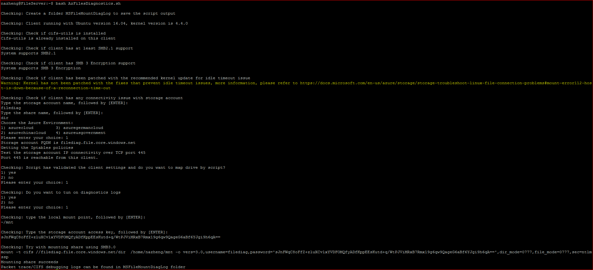

#  AzFileDiagnostics script for Linux

The AzFileDiagnostics script automates detection of most of the common symptoms mentioned in the [Azure Files troubleshooting guide](https://docs.microsoft.com/azure/storage/files/storage-troubleshoot-linux-file-connection-problems) and helps set up your environment to get optimal performance. 

# How to run the script

Script can run without any parameter and it will perform basic validations without needing Storage account information:

| Bash AzFileDiagnostics.sh. ./ AzFileDiagnostics.sh |
| --- |

Alternatively, you can specify optional parameters when running the script if you wish to perform validations against a specific storage account:

Example 1:

| bash AzFilesDiagnostics.sh -u //filediag.file.core.windows.net/dir |
| --- |

 Example 2:

| bash AzFilesDiagnostics.sh -a filediag -s dir -e AzureCloud |
| --- |

_NOTE: EnvironmentName specifies the Azure environment. Valid values are: AzureCloud, AzureChinaCloud, AzureUSGovernment. The default is AzureCloud._

## Parameters

| Parameter | Description |
|-|-|
| -u | Azure File share UNC path like storageaccount.file.core.windows.net\sharename.  |
| -a | Storage Account name providing the Azure File service. Script will validate the storage naming convention. |
| -s | Specify the file share name and script will validate the file share name convention. |
| -e | Specifies the Azure environment. Valid values are AzureCloud, AzureChinaCloud, AzureUSGovernment. The default is AzureCloud. |

# Validations Preformed:

•             Verify of Linux distributions: We recommend running following Linux Distributions: Ubuntu Server 14.04+ | RHEL 7+ | CentOS 7+ | Debian 8 | openSUSE 13.2+ | SUSE Linux Enterprise Server 12.

•             Verify of CIFS utils is installed.

•             Verify the minimum SMB/CIFS version 2.1 support on the client.

•             Check if SMB3 Encryption is supported or not. We have backported SMB3.0 Encryption to Ubuntu 16.4+ and SUSE 12.3+. Other distributions require kernel 4.11+

•             Check if kernel patches for the known Idle time out issue has been installed.

•             Verify the connectivity to storage account over TCP port 445. We dump the IPTABLES output to check if any firewall rule blocks traffic.

•             if client does not support SMB3.0 Encryption, verify if client runs in Azure VM and is located in the same region as Storage account.

•             if all validation passes, map the drive on behalf of the user. User can choose turn on the diagnostics to collect more logs (including CIFS traces/packet traces, which are saved into MSFileMountDiagLog subfolder)

# Sample Output:

  

# Feedback:

If there are additional troubleshooting topics for Azure Files that you would like to see, please reach out to our [MSDN forum](http://social.msdn.microsoft.com/Forums/windowsazure/en-US/home?forum=windowsazuredata).

#  Disclaimer

The sample scripts are not supported under any Microsoft standard support program or service. The sample scripts are provided AS IS without warranty of any kind. Microsoft further disclaims all implied warranties including, without limitation, any implied warranties of merchantability or of fitness for a particular purpose. The entire risk arising out of the use or performance of the sample scripts and documentation remains with you. In no event shall Microsoft, its authors, or anyone else involved in the creation, production, or delivery of the scripts be liable for any damages whatsoever (including, without limitation, damages for loss of business profits, business interruption, loss of business information, or other pecuniary loss) arising out of the use of or inability to use the sample scripts or documentation, even if Microsoft has been advised of the possibility of such damages.
