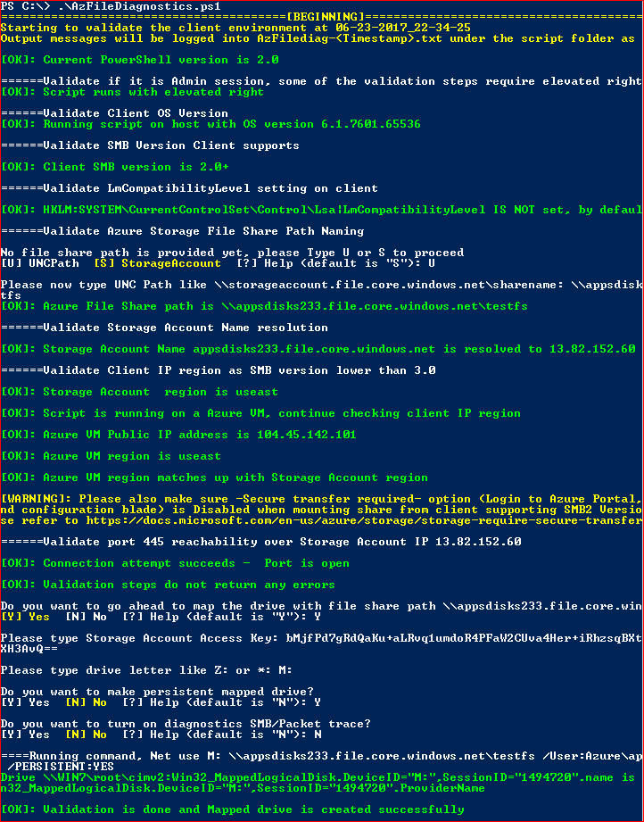

#  AzFileDiagnostics script for Windows

The AzFileDiagnostics script automates detection of most of the common symptoms mentioned in the [Azure Files troubleshooting guide](https://docs.microsoft.com/azure/storage/files/storage-troubleshoot-windows-file-connection-problems) and helps set up your environment to get optimal performance. 

## How to download the script

- Go to: https://github.com/Azure-Samples/azure-files-samples
- Click **Code** and then click **Download ZIP.**

## How to run the script

Script can run without any parameter and it will perform basic validations without needing Storage account information:

| .\AzFileDiagnostics.ps1 |
| --- |

Alternatively, you can specify optional parameters when running the script if you wish to perform validations against a specific storage account:

Example 1:

| .\AzFileDiagnostics.ps1 -UncPath \\storageaccountname.file.core.windows.net\sharename  |
| --- |

 Example 2:

| .\AzFileDiagnostics.ps1 -StorageAccountName <SA name> -FileShareName <share name> -Environmentname <AzureCloud> |
| --- |

_NOTE: EnvironmentName specifies the Azure environment. Valid values are: AzureCloud, AzureChinaCloud, AzureUSGovernment. The default is AzureCloud._

## Parameters

| Parameter | Description |
|-|-|
| -UNCPath | Azure File share UNC path like storageaccount.file.core.windows.net\sharename. |
| -StorageAccountName | Storage Account name providing the Azure File service. Script will validate the storage naming convention. |
| -FileShareName | Specify the file share name and script will validate the file share name convention. |
| -Environmentname | Specifies the Azure environment. Valid values are AzureCloud, AzureChinaCloud, AzureUSGovernment. The default is AzureCloud. |

## Validations Preformed

- Validation of OS version: OS version is Windows 7 and Windows Server 2008 R2 and above versions of Windows

- Validation of client SMB version: OS is running SMB 2.1 or 3.0.   

- Validate installation of KB3114025: For clients who are running Windows 8.1 or Windows Server 2012 R2, make sure that the hotfix KB3114025 is installed.

- LmCompatibilityLevel setting validation: Having NTLMv1 enabled creates a less-secure client.

- Storage account validation: Validate that the storage account name or the complete UNC path exists.

- Azure VM: If client machine is using SMB 2.x, validate client is Azure VM in the same region as storage account.

- For mounting from on-Prem: For mounting from on-prem client, TCP port 445 should be open in addition to having a client with SMB 3.0

- Firewall: Validates if local firewall rules are not blocking the connectivity to Azure Files

## Sample Output

  

## Feedback

If there are additional troubleshooting topics for Azure Files that you would like to see, please reach out to our [MSDN forum](http://social.msdn.microsoft.com/Forums/windowsazure/en-US/home?forum=windowsazuredata).

## Disclaimer

The sample scripts are not supported under any Microsoft standard support program or service. The sample scripts are provided AS IS without warranty of any kind. Microsoft further disclaims all implied warranties including, without limitation, any implied warranties of merchantability or of fitness for a particular purpose. The entire risk arising out of the use or performance of the sample scripts and documentation remains with you. In no event shall Microsoft, its authors, or anyone else involved in the creation, production, or delivery of the scripts be liable for any damages whatsoever (including, without limitation, damages for loss of business profits, business interruption, loss of business information, or other pecuniary loss) arising out of the use of or inability to use the sample scripts or documentation, even if Microsoft has been advised of the possibility of such damages.
