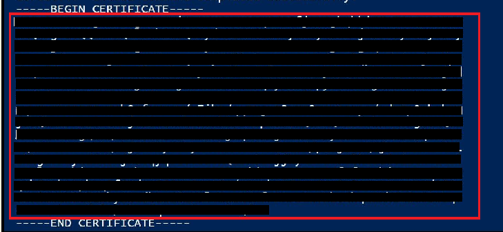
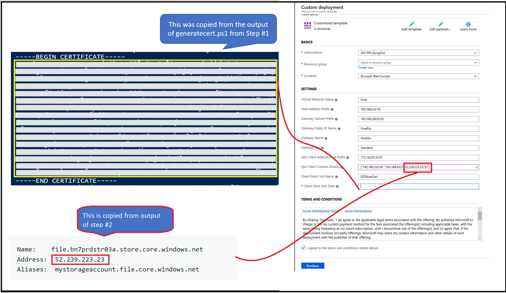
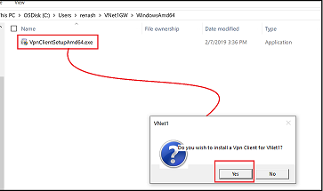

# Azure Files - Point-to-Site VPN Tunnel

<!-- TOC depthFrom:2 orderedList:false updateOnSave:false -->
- [Overview](#overview)
- [Prerequisite](#prerequisite)
- [Step 1 - Generate Root and Client Certificate](#step-1---generate-root-and-client-certificate)
- [Step 2 - Deploy ARM Template to create VNet and P2S VPN Gateway](#step-2---deploy-arm-template-to-create-vnet-and-p2s-vpn-gateway)
- [Step 3 - Download and install the VPN client](#step-3---download-and-install-the-vpn-client)
- [Step 4 - Install Client cert [Optional Step]](#step-4---install-client-cert-optional-step)
- [Step 5 - Configure VPN route so that traffic to specified Storage account(s) goes through the VPN Tunnel](#step-5---configure-vpn-route-so-that-traffic-to-specified-storage-accounts-goes-through-the-vpn-tunnel)
- [Step 6 - Persist and mount Azure File Share](#step-6---persist-and-mount-azure-file-share)
- [Conclusion](#conclusion)
<!-- /TOC -->

## Overview
Azure Files offers fully managed file shares in the cloud that are accessible via the industry standard Server Message Block (SMB) protocol. 

Azure file shares can be mounted concurrently by cloud or on-premises deployments of Windows, Linux, and macOS.  

While connecting from on-prem, sometimes ISPs block port 445.Azure VPN Gateway connects your on-premises networks to Azure through Point-to-Site VPNs in a similar way that you set up and connect to a remote branch office. The connectivity is secure and uses the industry-standard protocols SSTP.

With this tutorial, one will be able to work around port 445 block by sending SMB traffic from a Windows machine over a secure tunnel instead of on internet. 

This is a custom deployment for Azure Files of Point to Site VPN solution. In order for Point to Site VPN to work well Azure Files, Storage service endpoint should be added to virtual network
and Tunnel Type should only be SSTP. The template below takes care of these configuration settings.

>> NOTE
>>
>> General instructions is available at [Point to Site Setup in Portal doc](https://docs.microsoft.com/en-us/azure/vpn-gateway/vpn-gateway-howto-point-to-site-resource-manager-portal). The instructions below are specific to Azure Files Point to Site VPN interop.

## Prerequisite
 * You have a valid Subscription with admin permissions
 * A storage account
 * An Azure File Share
 * A Windows machine on which you would like to mount Azure file share


## Step 1 - Generate Root and Client Certificate

The steps below helps you create a Self-Signed certificate. If you're using an enterprise solution, you can use your existing certificate chain. Acquire the .cer file for the root certificate that you want to use. To learn more about certificates and Azure VPN interop read the [Azure Point To Site VPN documentation](https://docs.microsoft.com/en-us/azure/vpn-gateway/vpn-gateway-howto-point-to-site-classic-azure-portal#generatecerts).

* **Run** the [generatecert.ps1](./generatecert.ps1) powershell script **as Admin**. Update the variables to the desired values. Especially the ones highlighted in screenshot below.

  


* From the output console, **copy** the certificate signature from output window (the highlighted portion in screenshot below).The Certificate Signature will be an input to the ARM template. **DO NOT** copy `---- BEGIN CERTIFICATE ---` and `----- END CERTIFICATE -----`. **Only copy the text in between**.

    

This powershell script will generate self-signed root and client certificates and also export the root certificate signature and client certificate file. Client certificate is automatically installed on the computer that you used to generate it. If you want to install a client certificate on another client computer, the exported .pfx file is also generated in the script which will be stored on local drive.

Certificates are used by Azure to authenticate clients connecting to a VNet over a Point-to-Site VPN connection. Once you obtain a root certificate, you upload the public key information to Azure. The root certificate is then considered 'trusted' by Azure for connection over P2S to the virtual network. You also generate client certificates from the trusted root certificate, and then install them on each client computer. The client certificate is used to authenticate the client when it initiates a connection to the VNet.

>> NOTE
>>
>> In case you are using an enterprise root certificate, modify the script accordingly and execute.

>> NOTE
>>
>> Client cert needs to be installed on every connecting client. You can either install the same client cert (after it is created and exported as done in the script above) or create one for each client using root cert.

## Step 2 - Deploy ARM Template to create VNet and P2S VPN Gateway
<a href="https://portal.azure.com/#create/Microsoft.Template/uri/https%3A%2F%2Fraw.githubusercontent.com%2FAzure-Samples%2Fazure-files-samples%2Fmaster%2Fazuredeploy.json" target="_blank">
    
</a>
<a href="http://armviz.io/#/?load=https%3A%2Fraw.githubusercontent.com%2FAzure-Samples%2Fazure-files-samples%2Fmaster%2Fazuredeploy.json" target="_blank">
    
</a>

* Click **Deploy To Azure** button above. It will take you to Azure Portal.
* **Paste** the **Client Root Cert Data** copied from copied from previous step.
* Fill other necessary info and click **Purchase**.
* This deployment takes ~30-45 minutes to complete.

    

This template creates a VNet with a Gateway subnet associated to Azure Storage Service endpoint. It then creates a public IP which is used to create a VPN Gateway in the VNet. Finally it configures a Dynamic Routing gateway with Point-to-Site configuration with tunnel type SSTP including VPN client address pool, client root certificates and revoked certificates and then creates the Gateway.

## Step 3 - Download and install the VPN client

* Once the deployment fully completes, click on your gateway and go to the **Virtual Network Gateway >> Point-to-Site confirmation** tab from the left pane. **Download VPN client** by clicking the button on the top.

  

* Unzip the client and browse into the folder.

* If you are running amd64 - Run **VpnClientSetupAmd64.exe** from the **VPN Download client that was just installed WindowsAmd64** folder, run the x86 version in case your client is x86.

  

## Step 4 - Install Client cert [Optional Step]  

This step is only needed if you are installing VPN on a different computer than where certificates were generated using [generatecert.ps1](./generatecert.ps1) in step # 1 above. If you are using the same machine, the client cert was already installed as part of step #1.

These instructions are assuming that you generated the client cert and exported it when [generatecert.ps1](./generatecert.ps1) was run.

* Locate the cert on your machine that was exported and **double click** on **P2SClientCert.pfx**. This will be at the path that you specified for variable *$pathtostoreoutputfiles*.

    

* Follow the prompt and when prompted for password, input the value you had provided to variable *$clientcertpassword* to script.


* Follow the prompt and use default values until it says that certificate is successfully installed.

    


## Step 5 - Configure VPN route so that traffic to specified Storage account(s) goes through the VPN Tunnel

* Open [RouteSetupAndConnectToVPN.ps1](RouteSetupAndConnectToVPN.ps1) powershell script.

* Replace the value of ***$VNetId*** in RouteSetupAndConnectToVPN.ps1 by copying it from the **downloaded and unzipped VPN client folder path -> Generic -> VpnSettings.xml**.

  

* Replace the value of **$FileShareHostList** information with your own. `You can give multiple accounts separated by comma.`
* Run the RouteSetupAndConnectToVPN.ps1 script **as ADMIN**.

  

* If you have an existing mounted share, you will need to **re-establish the SMB connection** by re-mounting the share for VPN to take effect.

> Storage Account IP can get updated automatically. RouteSetupAndConnectToVPN.ps1 should be **run as a scheduled task at startup** to reconnect the VPN if a constant connection is desired with **admin permissions**.

This script will fetch the IP address of the Storage account in which your file share resides and update the routes.txt located under C:\users\YOURUSERNAME\AppData\Roaming\Microsoft\Network\Connections\Cm folder. This script will also connect to VPN.

## Step 6 - Persist and mount Azure File Share

Persist your Azure Files credentials and use a persistent mount to enable mounting at every startup after reboot.

Here are the details instructions to [persist connection for Azure Files](https://docs.microsoft.com/en-us/azure/storage/files/storage-how-to-use-files-windows#persisting-azure-file-share-credentials-in-windows). At a high level follow the instructions below - 

* Persist credentials using following command

    ```
    cmdkey /add:<your-storage-account-name>.file.core.windows.net /user:AZURE\<your-storage-account-name> /pass:<your-storage-account-key>
    ```
* View the persisted credentials. There should be an entry with your Storage Account name.

    ```
    cmdkey /list
    ```

    
* Mount the file share using *-Persist* and with no credentials provided. The example below shows mapping to *X* drive, but you can mount to any drive letter.

    ```PowerShell
    New-PSDrive -Name X -PSProvider FileSystem -Root "\\<your-storage-account-name>.file.core.windows.net\<your-file-share-name>" -Persist 
    ```
## Conclusion

Thats it. This will get you to a Point to Site VPN setup that works well with Azure Files.

